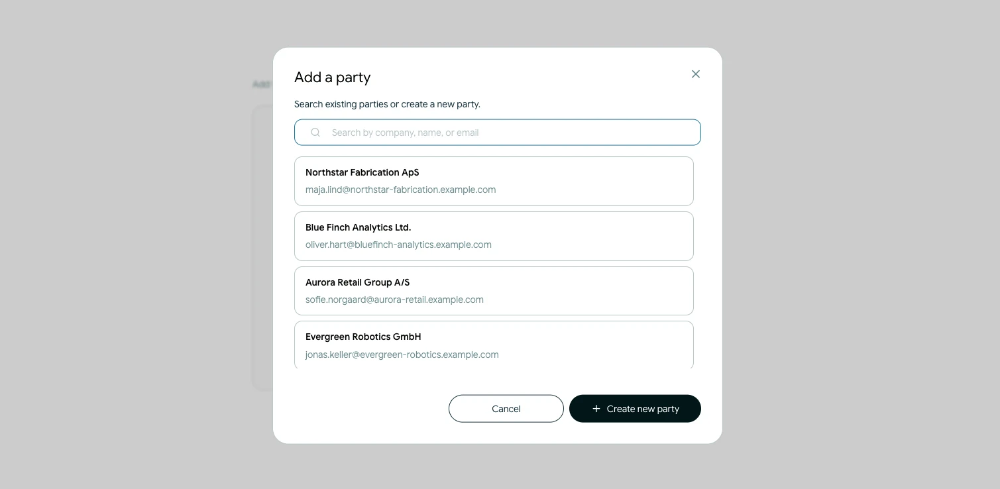
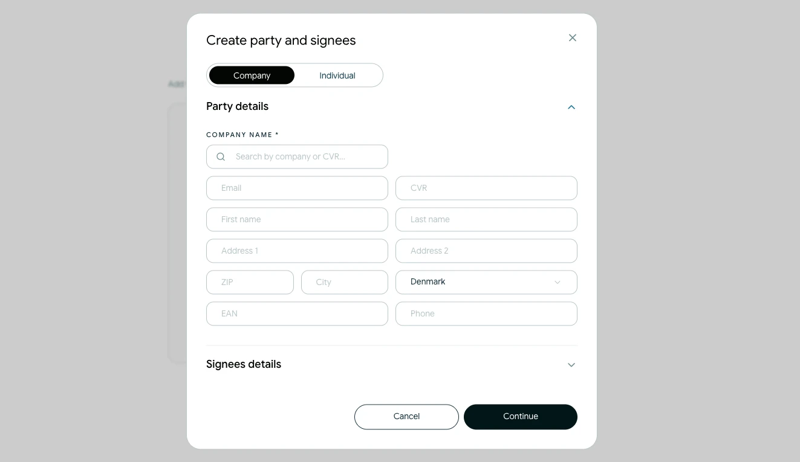
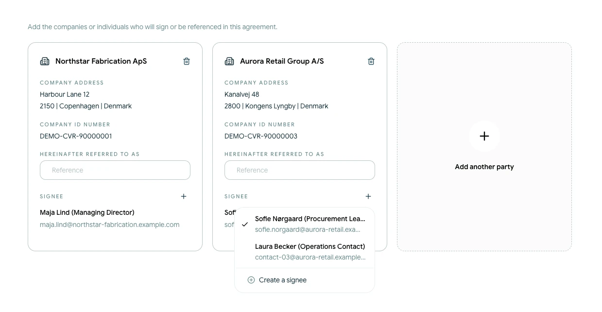

# Føj parter til en kontrakt

Parter er de virksomheder eller personer, der indgår i en aftale. Hver part kan have en eller flere personer tilknyttet som underskrivere.

## Tilføj en eksisterende part

<!-- help-image:parties -->

1. Åbn kontraktens trin **Parter**.
2. Vælg **Tilføj en anden part**.
3. Søg blandt de tilgængelige parter efter virksomhed, navn eller e-mail.
4. Vælg den part, du vil tilføje.

De gemte partsoplysninger føjes til denne kontrakt. Du kan også angive den betegnelse, der skal bruges om parten i aftalen.

## Opret en ny part

<!-- help-image:create-party -->

Hvis parten ikke allerede findes, skal du vælge **Opret ny part**. Tilføj de relevante virksomheds- eller personoplysninger, og gem parten. Den bliver tilgængelig i kontrakten og kan genbruges i fremtidige kontrakter.

## Vælg underskrivere

<!-- help-image:assign-party -->

Vælg en gemt underskriver for hver part, eller opret en ny. Hver part skal have mindst én underskriver, før du kan fortsætte.

Kontrollér navne og e-mailadresser omhyggeligt. Oplysningerne bruges senere, når Scriboflow klargør og sender underskriftsanmodningerne. Du kan ændre underskriftsrækkefølgen under **Underskrift**.

Brug **Fjern part** på partens kort for at fjerne den fra den aktuelle kladde. Det sletter ikke den gemte part fra din organisation.
