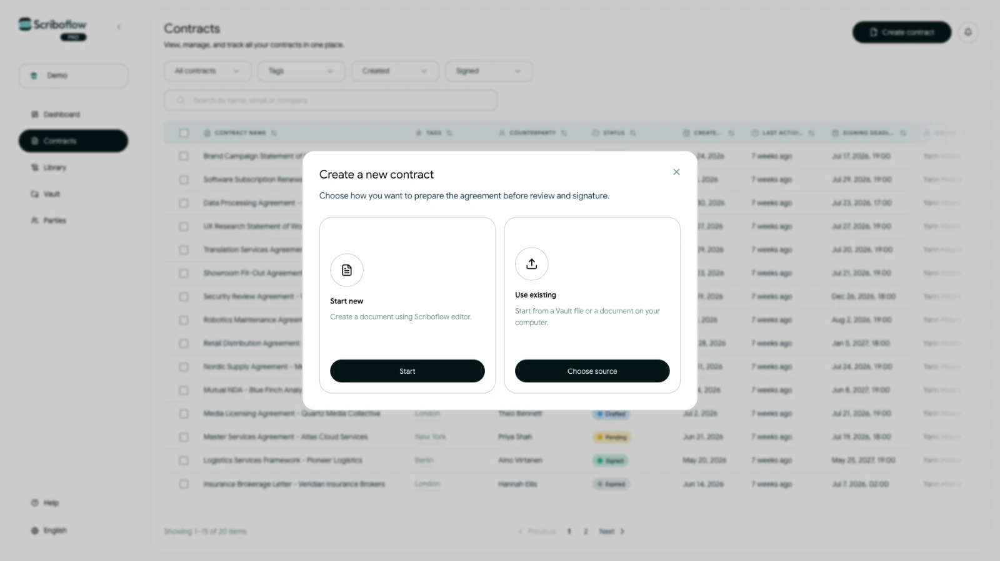

# Opret en kontrakt fra bunden

Start med en tom kontrakt, når du vil skrive aftalen direkte i Scriboflow.

## Start en ny kladde

<!-- help-image:start-new -->

1. Åbn dashboardet eller **Kontrakter**.
2. Vælg **Opret kontrakt**.
3. Vælg **Opret ny kontrakt**, og vælg derefter **Start kladde**.

Scriboflow opretter en unavngiven kladde og åbner kontraktflowet. Du kan omdøbe kontrakten fra overskriften øverst på siden.

## Gennemfør kontraktflowet

Arbejd gennem trinnene i rækkefølge:

1. **Parter:** Tilføj de virksomheder eller personer, der er involveret, og vælg deres underskrivere.
2. **Vilkår:** Skriv og formatér aftalen. Du kan også indsætte gemte klausuler, datafelter og parthenvisninger.
3. **Bilag:** Tilføj de filer, der skal følge med kontrakten.
4. **Underskrift:** Vælg underskriftsmetode, underskriftsrækkefølge og interval for påmindelser.
5. **Gennemse:** Kontrollér kontrakten, modtagerne og afsendelsesoplysningerne, før du sender.

Kontrakten forbliver en kladde, indtil den bliver sendt. Scriboflow gemmer ændringer, mens du arbejder, men kontrollér gemmestatussen, før du forlader siden.
