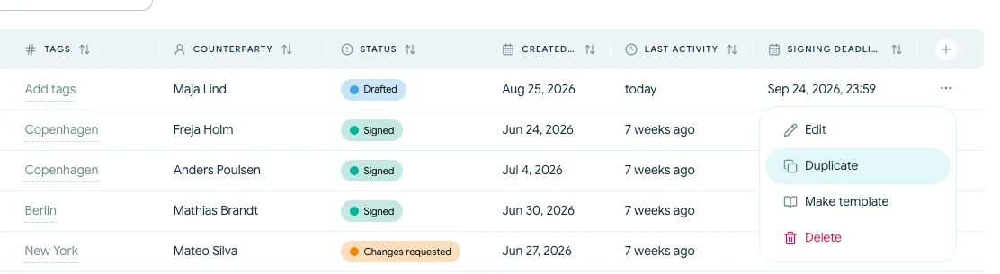

# Duplikér en kontrakt

Duplikér en kontrakt, når du vil oprette en ny kladde på baggrund af en eksisterende aktiv kontrakt uden at ændre originalen.

## Opret kopien

<!-- help-image:duplicate -->

1. Åbn **Kontrakter**.
2. Find den kontrakt, du vil kopiere.
3. Åbn dens handlingsmenu, og vælg **Duplikér**.

Scriboflow opretter en separat kladde og tilføjer en kopibetegnelse til navnet. Kopien kan indeholde det seneste kontraktindhold, parter, underskrivere, bilag og underskriftsopsætning fra kildekontrakten.

## Gennemgå den nye kladde

Duplikatet er uafhængigt af originalen. Ændringer i den ene kontrakt opdaterer ikke den anden.

Før du sender kopien, skal du:

- Give den et tydeligt navn
- Kontrollere at alle parter og underskrivere stadig er relevante
- Opdatere datoer, værdier og kontraktvilkår
- Gennemgå bilag og afsendelsesoplysninger
- Angive en ny underskriftsfrist

Tidligere underskrifter, aktive underskriftslinks og aktivitetshistorik overføres ikke til det nye underskriftsforløb.

Du kan duplikere en afsluttet, afvist eller udløbet kontrakt, mens den stadig er på den aktive liste. Hvis kontrakten er arkiveret, skal du gendanne den, før du kontrollerer dens tilgængelige handlinger.
