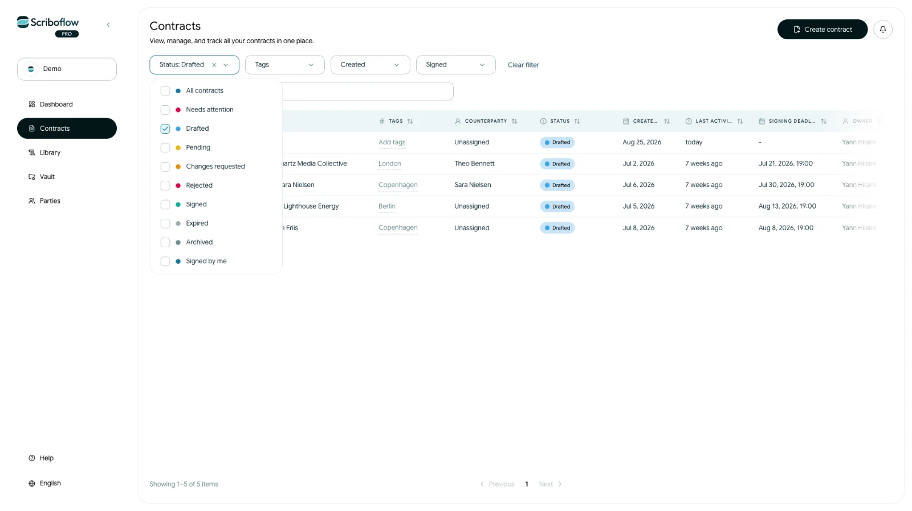
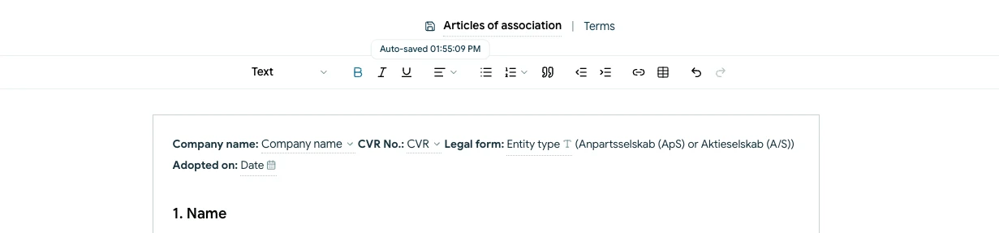

# Rediger og gem en kontraktkladde

Du kan forlade en ufærdig kontrakt og vende tilbage til den, mens den stadig er en kladde.

## Åbn kladden

<!-- help-image:draft-contract -->

1. Åbn **Kontrakter**.
2. Filtrér efter **Kladde**, hvis det er nødvendigt.
3. Vælg kontrakten, eller åbn dens handlingsmenu, og vælg **Rediger**.

Kontrakten åbner på det aktuelle trin. Brug trinnavigationen til at gå tilbage til tidligere sektioner som **Parter**, **Vilkår** eller **Bilag**.

## Foretag dine ændringer

Opdater kontraktnavnet, parterne, vilkårene, bilagene eller underskriftsopsætningen efter behov. Scriboflow gemmer understøttede kladdeændringer automatisk, mens du arbejder. Statussen øverst i kontrakten viser, hvornår de seneste ændringer blev gemt.

Hvis Scriboflow midlertidigt gemmer en ændring lokalt, skal du holde siden åben, indtil den er synkroniseret. Hvis der vises en gemmefejl, skal du prøve igen, før du fortsætter.

## Før du forlader kladden

<!-- help-image:draft-saved -->

- Kontrollér at gemmestatussen er opdateret.
- Brug **Forhåndsvisning** til at gennemgå det seneste dokument.
- Fortsæt først til næste trin, når den aktuelle sektion er færdig.

Når kontrakten er sendt, er den aktuelle version låst for almindelig redigering. Hvis en modtager ønsker ændringer, skal du følge flowet for ændringsønsker.
