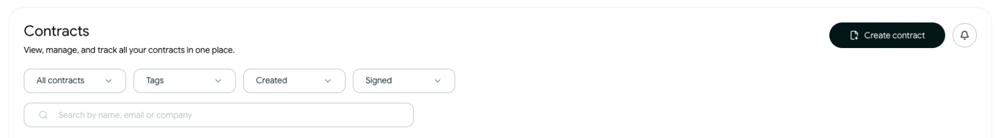
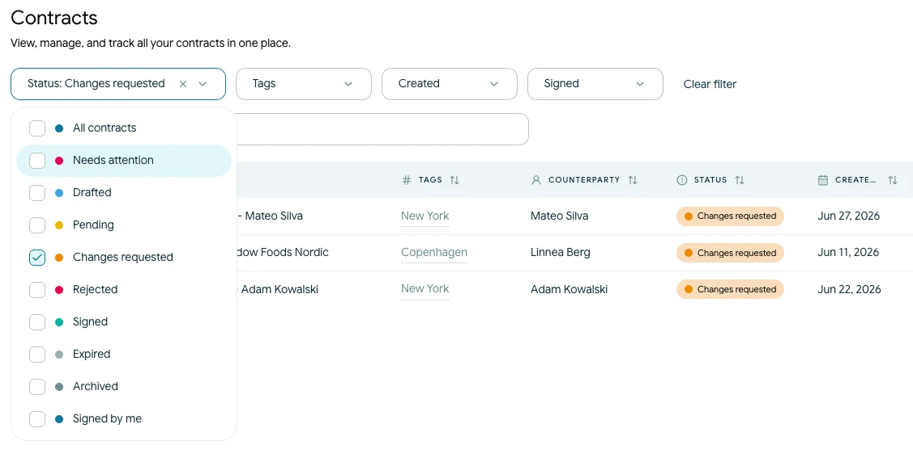
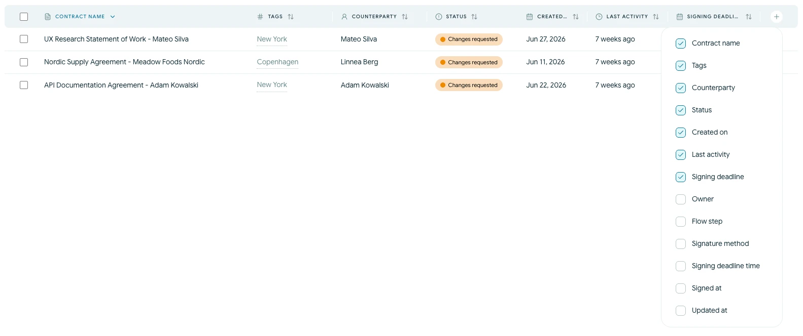

# Find og filtrer kontrakter

Åbn **Kontrakter** for at søge i og organisere kontrakterne i din organisation.

## Søg i kontraktlisten

<!-- help-image:search -->

Brug søgefeltet til at finde en kontrakt efter:

- Kontraktnavn
- E-mailadresse
- Virksomhedsnavn

Søgningen fungerer sammen med de aktive filtre. Hvis en kontrakt mangler i resultaterne, skal du rydde søgningen eller filtrene og prøve igen.

## Anvend filtre

<!-- help-image:filter -->

Brug de tilgængelige kontroller til at afgrænse listen efter:

- Status, herunder **Kladde**, **Afventer**, **Ændringer ønskes**, **Underskrevet**, **Afvist** og **Udløbet**
- **Kræver opmærksomhed** for kontrakter, der skal følges op på
- Oprettelses- eller underskriftsdato
- En fast eller brugerdefineret periode
- Tags
- Arkiverede kontrakter

Vælg et aktivt filter igen, eller brug **Ryd filter** for at fjerne det.

## Sortér og tilpas tabellen

<!-- help-image:sort -->

Vælg en kolonneoverskrift for at sortere de synlige kontrakter. Du kan sortere efter felter som kontraktnavn, status, oprettelsesdato og seneste aktivitet.

Brug kolonnekontrollen til at vise flere oplysninger, herunder aktuelt flow-trin, underskriftsmetode, underskriftsfrist, underskriftsdato eller opdateringsdato. De tilgængelige kolonner kan afhænge af skærmens bredde.
