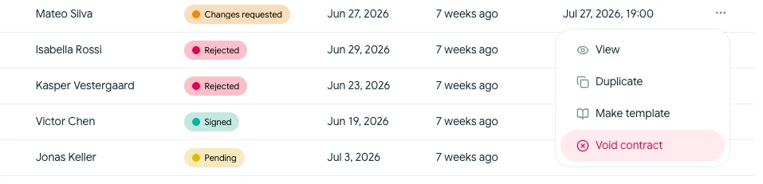

# Annullér en kontrakt

Annullér en kontrakt, når det aktive underskriftsforløb skal stoppe, og modtagerne ikke længere skal kunne bruge deres udestående underskriftslinks.

Du kan annullere en kontrakt, mens den har statussen **Afventer** eller **Ændringer ønskes**.

## Annullér underskriftsforløbet

<!-- help-image:void -->

1. Åbn **Kontrakter**, og find kontrakten.
2. Åbn dens handlingsmenu, og vælg **Annullér kontrakt**. Du kan også bruge den tilgængelige handling fra kontraktoversigten.
3. Gennemgå bekræftelsen, og vælg **Annullér kontrakt**.

Annulleringen gælder for det aktuelle underskriftsforløb:

- Aktive underskriftslinks lukkes
- Modtagerne kan ikke fortsætte underskriften gennem disse links
- Kontraktposten og aktivitetshistorikken forbliver tilgængelige
- Tidslinjen registrerer, at kontrakten blev annulleret

Annullering er ikke det samme som at slette en kladde. Den bevarer det, der blev sendt, og det der efterfølgende skete.

Du kan ikke genoptage det samme underskriftsforløb, når det er annulleret. Duplikér den lukkede kontrakt for at oprette en separat kladde, hvis du skal revidere og sende aftalen igen. Du kan arkivere den lukkede kontrakt, når du ikke længere har brug for den på den aktive liste.
