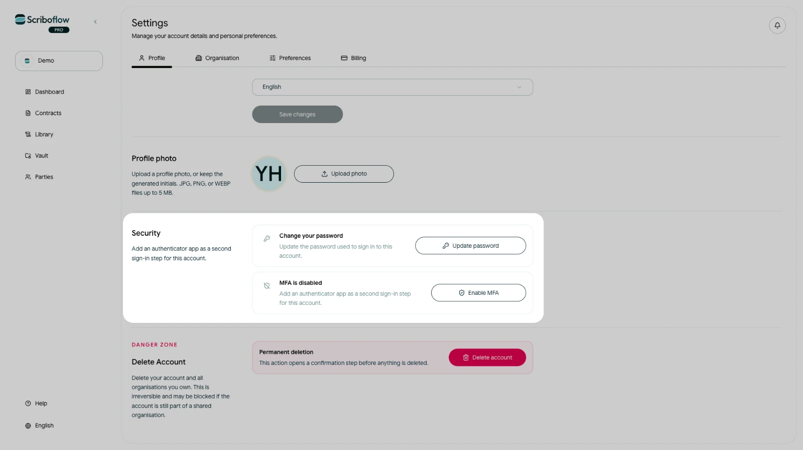

# Opsæt multifaktorautentifikation

Multifaktorautentifikation, eller MFA, tilføjer en kode fra en authenticator-app som ekstra trin ved log ind.

## Aktivér MFA

<!-- help-image:image -->

1. Åbn **Indstillinger**, og vælg **Profil**.
2. Find sektionen **Sikkerhed**.
3. Vælg **Aktivér MFA**.
4. Scan QR-koden med en authenticator-app. Du kan også kopiere opsætningsnøglen manuelt ind i appen.
5. Indtast den sekscifrede kode fra authenticator-appen.
6. Vælg **Aktivér**.

Efter opsætningen beder Scriboflow om en aktuel sekscifret authenticator-kode, når der kræves ekstra bekræftelse.

## Deaktivér MFA

Åbn den samme sektion under **Sikkerhed**, og vælg **Deaktivér MFA**. Scriboflow kan bede dig om at bekræfte din aktuelle session, før ændringen gennemføres.

Sørg for fortsat at have adgang til authenticator-appen, efter du har aktiveret MFA. Hvis du mister adgangen og ikke kan logge ind, kan du [kontakte Scriboflow](/da/contact) for at få hjælp. Send aldrig din opsætningsnøgle eller dine koder til andre.
