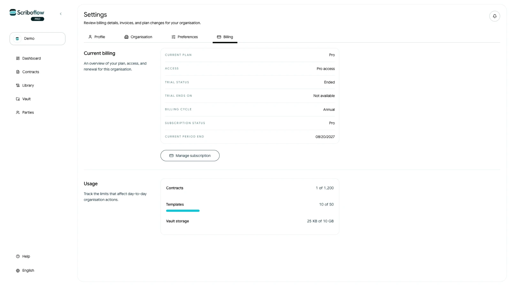
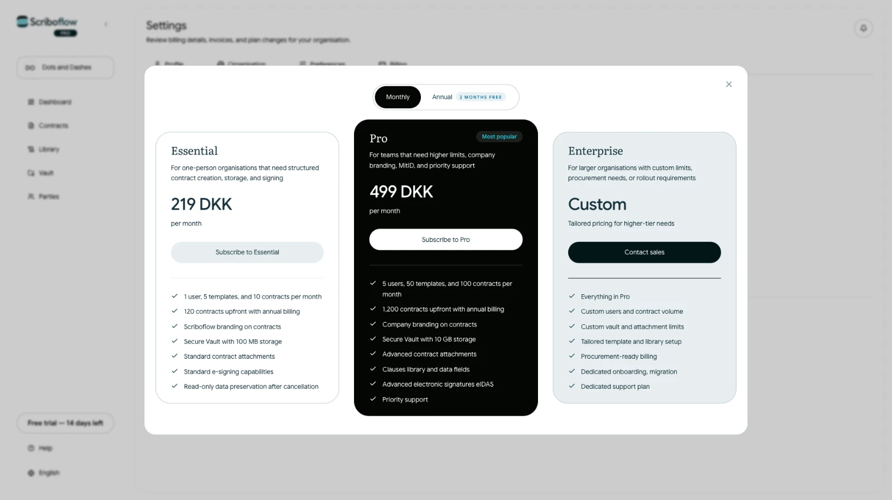

# Forstå din gratis prøveperiode

En ny Scriboflow-organisation starter med en gratis 14-dages prøveperiode på Pro. Du behøver ikke tilføje et betalingskort for at starte prøveperioden.

I prøveperioden kan organisationen bruge de funktioner og grænser, der er inkluderet i Pro.

## Se, hvornår prøveperioden slutter

<!-- help-image:image -->

Åbn **Indstillinger**, og vælg **Fakturering**. Under **Aktuel fakturering** kan du se prøveperiodens status og slutdato.

## Fortsæt efter prøveperioden

<!-- help-image:image-1 -->

Organisationens ejer kan vælge en betalt plan, før prøveperioden slutter:

1. Åbn **Indstillinger**, og vælg **Fakturering**.
2. Vælg **Administrer abonnement**.
3. Vælg et faktureringsinterval og en plan.
4. Gennemfør betalingen.

Hvis der ikke vælges en plan, bliver organisationen skrivebeskyttet, når prøveperioden slutter. Eksisterende kontrakter og filer er stadig tilgængelige, men du kan ikke oprette eller sende nye kontrakter, før ejeren vælger en plan.
