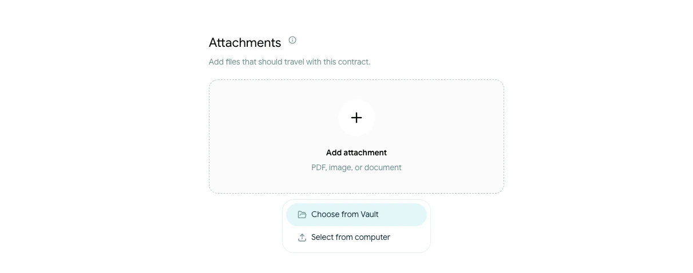

# Add and manage contract attachments

Use attachments for supporting documents that should stay with the contract, such as annexes, schedules or reference files.

## Add an attachment

<!-- help-image:attachment -->

1. Open the contract's **Attachments** step.
2. Upload a file from your computer or choose an existing file from the Vault.
3. Wait for the upload to finish before leaving the step.

The screen shows the current file, total-size and attachment-count limits. If a file is not accepted, check its format and size before trying again.

## Review the attachment list

Attachments that Scriboflow can prepare for review are shown after the main contract in the contract package. Other supported files remain available as downloads. The attachment list shows how each file will be handled.

You can change the order of attachments or remove a file while the contract is editable. Removing it from the contract does not remove the original file from the Vault.

Before sending, open **Preview** and confirm that:

- The correct files are attached
- The review order is correct
- File names are clear to recipients
- No outdated or confidential file was added by mistake

Once the contract has been sent, its current attachment package is preserved with that contract version.
