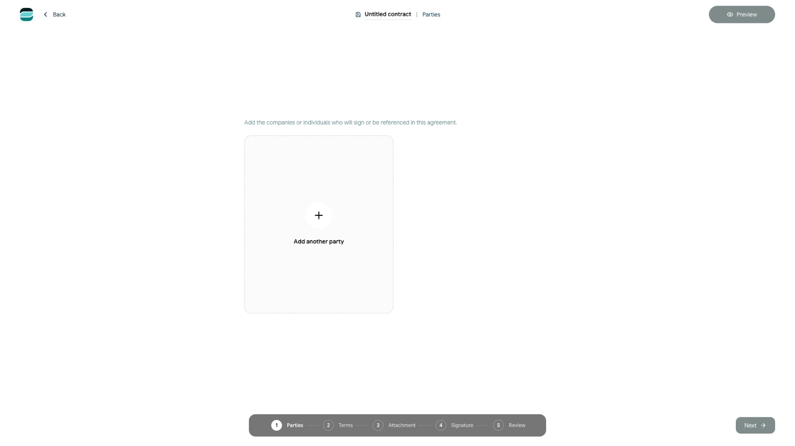

# Import an existing contract

Use an existing document when the agreement has already been prepared outside Scriboflow.

## Choose the document

<!-- help-image:use-existing -->

1. Open the dashboard or **Contracts**.
2. Select **Create contract**.
3. Under **Use existing**, select **Choose source**.
4. Choose a file from **Vault files** or **Local computer**.

You can start from a PDF, Word document or supported text file.

## Continue with the imported contract

Scriboflow handles the document according to its file type:

- A PDF continues as a fixed document. You can prepare it for signing, but you cannot edit its document text in Scriboflow.
- Word and supported text files are converted and opened in **Terms**, where you can review and edit the imported content.

Always review converted text and formatting before sending the contract.

Add the relevant parties, attachments and signature settings, then use the final review step to check the complete contract package. The imported source remains part of the new Scriboflow contract; the original file on your computer or in the Vault is not changed.
