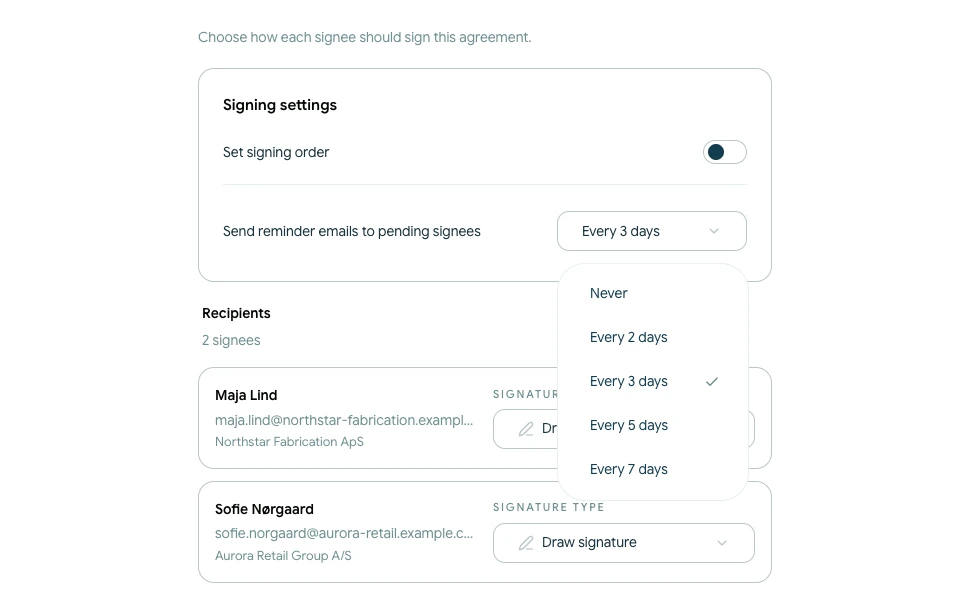
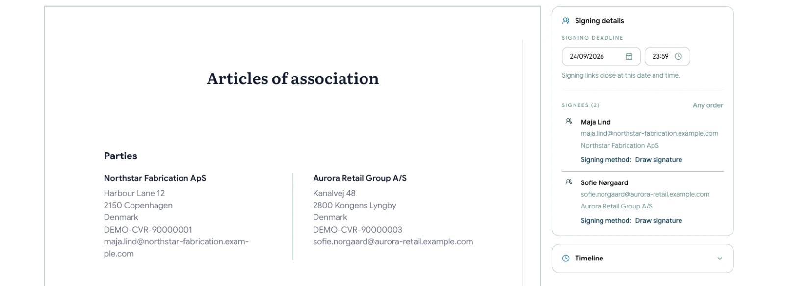

# Manage signing deadlines and reminders

Before sending a contract, set a signing deadline and decide whether pending signees should receive automatic reminder emails.

## Choose a reminder frequency

<!-- help-image:reminders -->

Open the **Signature** step. Under **Send reminder emails to pending signees**, choose:

- Never
- Every 2 days
- Every 3 days
- Every 5 days
- Every 7 days

Reminders are sent only to signees who are still waiting to complete their action. The selected frequency is part of the current contract's signing setup.

## Set the signing deadline

<!-- help-image:deadline -->

Continue to **Review** and choose the signing deadline date and time. The deadline must be in the future.

Signing links close at the selected date and time. If all required signatures have not been completed, the contract becomes **Expired** and the active links no longer work.

## Check the settings before sending

Use the final review to confirm:

- The deadline gives every recipient enough time
- The reminder frequency is appropriate for the agreement
- Recipient email addresses are correct

The signing deadline controls the current signing window. It is separate from any expiry date written into the contract terms.
