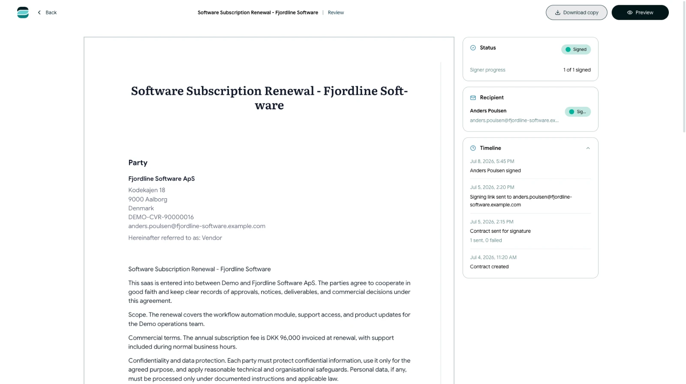

# Review a contract's activity and history

<!-- help-image:review -->

Open a sent or completed contract to see its current status and the actions recorded during the signing process.

## Open the contract overview

1. Open **Contracts**.
2. Find the contract by searching or filtering the list.
3. Select the contract or choose **View** from its actions menu.

The overview shows information such as the current status, latest activity, most recent sending time and signer progress.

## Check recipient progress

Each recipient has a current state. Depending on their activity, Scriboflow can show that they are waiting, have viewed the contract, have signed or have rejected it. A signing request can also show as expired, replaced or revoked.

## Review notes and timeline events

If a recipient requested changes or rejected the contract, read the available notes before deciding what to do next.

The timeline records important events such as:

- Contract creation and sending
- Recipient views and signatures
- Requested changes or rejection
- Reminder and resend activity
- Expiration, voiding, archiving or restoration

Use the timeline to understand the sequence of events. For more detail about recorded signing evidence, see the related security article.
