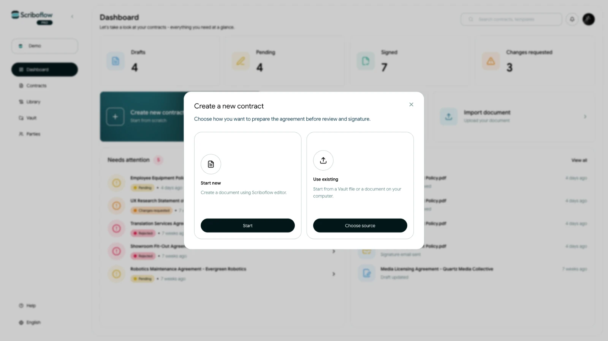

# Create your first contract

Scriboflow lets you begin with a blank contract, a saved template, a Scriboflow starter template, or a PDF. Choose the option that matches the document you already have.

## Choose a starting point

<!-- help-image:image -->
From the dashboard, start a new contract and choose how you want to create it. A blank contract opens the editor, while a template gives you reusable content to adapt. A PDF is useful when the document is already final and only needs to move through review and signing.

## Complete the contract details

Add the companies or people involved, assign the relevant signers, and work through the contract steps shown in Scriboflow. The available steps keep the document, parties, attachments, signing choices, and sending details together.

## Review before sending

Use the preview before you send the contract. Check the document content, party details, signers, signing order, subject, and message. Scriboflow will show anything that still needs attention before the contract can be sent.
