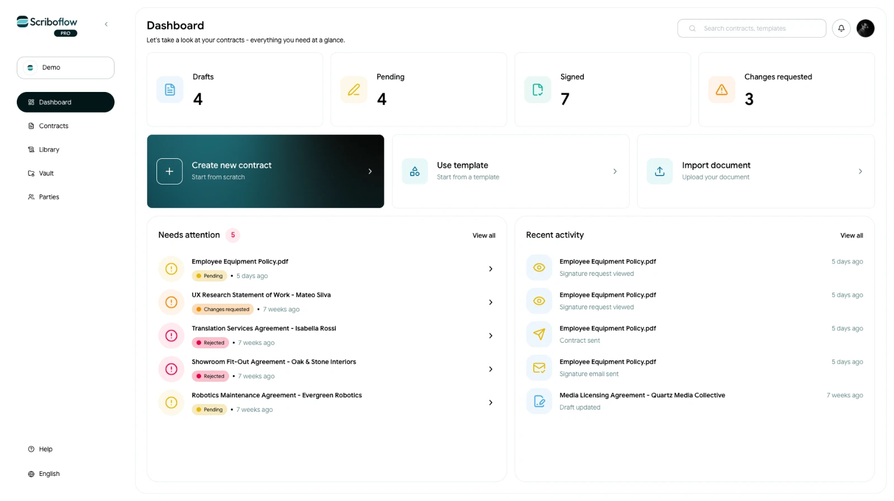

# Understand the Scriboflow dashboard

The dashboard gives you a quick overview of your organisation’s contracts and recent activity.

<!-- help-image:image -->

## Contract overview

The cards at the top show how many contracts are currently in each status:

- **Drafts:** Contracts that have not yet been sent
- **Pending:** Contracts awaiting action from one or more recipients
- **Signed:** Completed contracts signed by all required parties
- **Changes requested:** Contracts returned by a recipient with requested changes

Select a card to view the corresponding contracts.

## Create or upload a contract

You can start a contract directly from the dashboard in three ways:

- **Create new contract:** Start from scratch
- **Use template:** Start with a ready-made or saved template
- **Import document:** Upload your own contract

## Needs attention

This section highlights contracts that require action or follow-up. Select a contract to open it and see what needs to be done.

## Recent activity

Recent activity shows the latest actions taken across your organisation’s contracts, helping you keep track of what has changed.

## Search and navigation

Use the search bar to find contracts and templates.

The sidebar provides access to:

- **Contracts:** View and manage all contracts
- **Library:** Access templates, clauses and data fields
- **Vault:** Securely store reusable documents, annexes and schedules
- **Parties:** Manage the people and organisations used in your contracts

You can also access notifications, account settings, the Help Center and language options from the dashboard.
