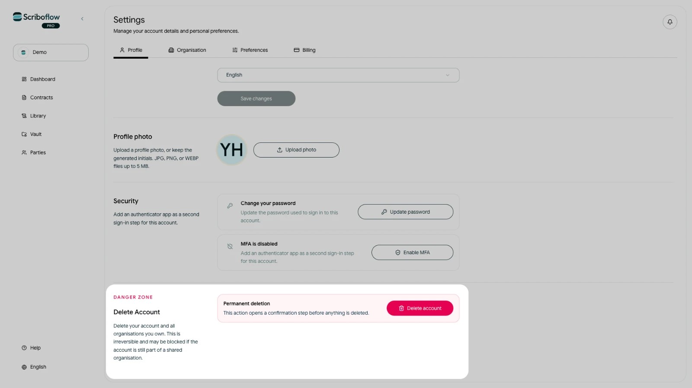

# Understand data retention and deletion

Scriboflow retains account and organisation data while needed to provide the service. Some records can remain for limited operational, security, billing, legal, dispute or secure-deletion periods afterwards.

## Delete individual content

Where Scriboflow provides a delete action, use it to remove the relevant draft, template, party, Vault file or other item from the active organisation. Deletion from distributed systems and provider media can take additional time.

Contract and legal evidence may need different treatment from ordinary working files. Certain acceptance, transaction, security and operational records can be retained where their purpose or applicable law requires it.

## Ending a subscription is not deletion

Canceling a subscription makes the organisation read-only after the paid period ends. Existing contracts, templates and files remain available; cancellation does not request their deletion.

## Delete an account

<!-- help-image:image -->

You can start account deletion from **Settings** > **Profile** > **Delete account**. The action may be blocked when the account belongs to another organisation or owns an organisation with other members.

Deleting an individual account does not by itself guarantee deletion of organisation-owned data. An authorised organisation representative should separately request return or deletion of organisation data.

For an organisation-level request or questions about what must be retained, email [privacy@scriboflow.com](mailto:privacy@scriboflow.com). Read the current [Privacy Policy](/privacy-policy) and [Data Processing Agreement](/trust/dpa) for the governing details.
