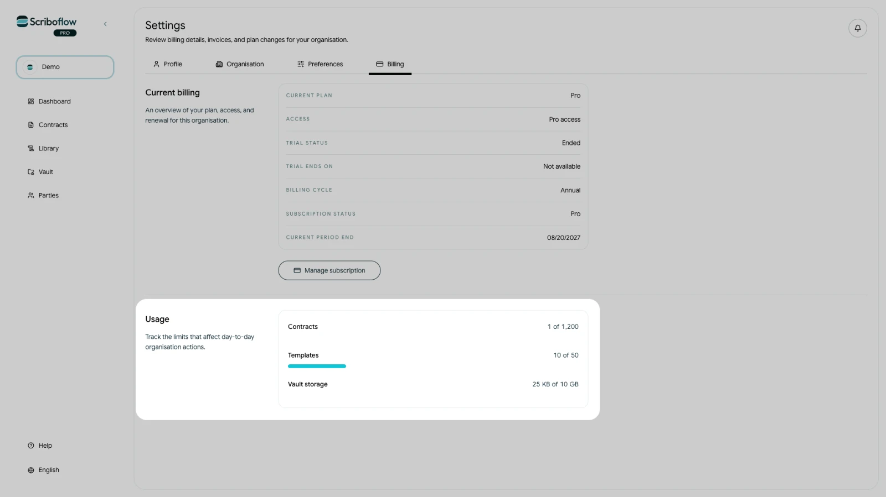

# View your subscription and usage

The Billing page shows the subscription and usage for your selected organisation.

1. Open **Settings**.
2. Select **Billing**.

## Current billing

The **Current billing** section shows:

- Your current plan and access level
- Your trial status and end date, when applicable
- Your monthly or annual billing cycle
- Your subscription status
- The end of the current billing period

## Usage

<!-- help-image:usage -->

The **Usage** section shows how much of the organisation's allowance is currently in use for:

- Contracts
- Users
- Templates
- Vault storage

Make sure the correct organisation is selected before reviewing these figures. Subscription changes only apply to the selected organisation, and only its owner can manage billing.
